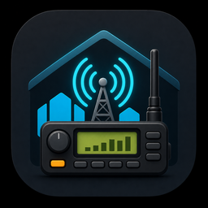
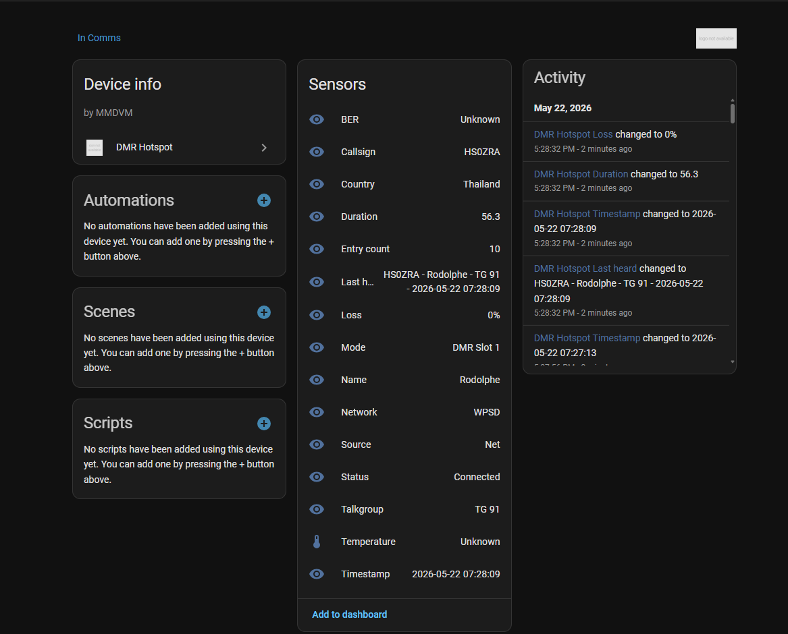

# DMR Hotspot for Home Assistant



A custom Home Assistant integration for monitoring a DMR hotspot such as WPSD,
Pi-Star, or an MMDVMHost-based gateway.

Version: `0.0.7`

## Features

- UI-based setup from Home Assistant
- Periodic polling through Home Assistant's data update coordinator
- Device and diagnostic sensors for hotspot status
- Designed for the WPSD last-heard API
- Companion HACS dashboard card with MCS2000 and R7-inspired styles
- HACS-ready repository layout

Supported WPSD last-heard fields include `time_utc`, `mode`, `callsign`,
`name`, `country`, `target`, `src`, `duration`, and `loss`.

## Screenshot



## Branding

Branding assets are included in:

```text
brand/icon.png
brand/logo.png
assets/
brands/dmr_hotspot/icon.svg
brands/dmr_hotspot/icon.png
brands/dmr_hotspot/logo.png
custom_components/dmr_hotspot/brand/icon.png
custom_components/dmr_hotspot/brand/logo.png
custom_components/dmr_hotspot/icon.png
custom_components/dmr_hotspot/logo.png
```

These are ready for GitHub/HACS presentation and future Home Assistant Brands
submission work. Home Assistant may still require a formal Brands repository
submission before the integration logo appears consistently in all HA UI areas.

## Installation

### HACS custom repository

1. Open HACS in Home Assistant.
2. Add this repository as a custom repository.
3. Select `Integration` as the repository category.
4. Install **DMR Hotspot**.
5. Restart Home Assistant.

### Manual installation

Copy `custom_components/dmr_hotspot` into your Home Assistant
`custom_components` directory, then restart Home Assistant.

## Configuration

1. Go to **Settings** -> **Devices & services**.
2. Select **Add integration**.
3. Search for **DMR Hotspot**.
4. Enter the local hotspot URL, for example:

```text
http://wpsd.local
http://pi-star.local
http://192.168.1.50
```

The integration reads the WPSD API from:

```text
http://<hotspot-hostname-or-ip>/api/?limit=10&names=true&country=true
```

No changes are required on the hotspot Linux installation.

The default polling interval is `5` seconds. You can change this from the
integration options in Home Assistant. The minimum supported interval is `2`
seconds.

## Current Status

This integration currently provides the release-ready Home Assistant structure
and a WPSD API polling client. The parser is intentionally tolerant while we
confirm the exact JSON shape returned by your hotspot.

## Release

Latest tagged release: `v0.0.7`

The GitHub repository is:

```text
https://github.com/rodgrech/WPSD-home-assistant
```

## Changelog

See [CHANGELOG.md](CHANGELOG.md) for the full release history.

Recent changes:

- `0.0.7`: added local Home Assistant/HACS brand folders, added fallback MDI
  sensor icons, lowered the minimum polling interval to 2 seconds, and mapped
  Raspberry Pi/WPSD CPU temperature keys.
- `0.0.6`: updated device metadata and bundled PNG brand assets to improve
  Home Assistant icon/logo display.
- `0.0.5`: documented the standalone WPSD Status Card Mod dashboard card and
  current R7 YAML example.
- `0.0.4`: faster default polling, configurable scan interval options, and
  modern card BER/loss layout polish.
- `0.0.3`: mapped real WPSD API fields, added source/loss sensors, and added
  explicit fallback names for all sensors.
- `0.0.2`: added branding assets, fixed sensor values showing as unknown, and
  added entry count troubleshooting.
- `0.0.1`: initial Home Assistant custom integration and dashboard examples.

## Dashboard Card

The polished dashboard card now lives in its own HACS dashboard repository:

[WPSD Status Card Mod](https://github.com/rodgrech/WPSD-Status-Card-Mod)

Install it in HACS as a custom repository using category:

```text
Dashboard
```

The card supports:

- `style: mcs2000`
- `style: r7`

HACS resource path:

```text
/hacsfiles/WPSD-Status-Card-Mod/wpsd-radio-card.js
```

Example R7 card:

```yaml
type: custom:wpsd-radio-card
style: r7
callsign_entity: sensor.dmr_hotspot_callsign
talkgroup_entity: sensor.dmr_hotspot_talkgroup
mode_entity: sensor.dmr_hotspot_mode
source_entity: sensor.dmr_hotspot_source
loss_entity: sensor.dmr_hotspot_loss
ber_entity: sensor.dmr_hotspot_ber
name_entity: sensor.dmr_hotspot_name
country_entity: sensor.dmr_hotspot_country
channel_names:
  "91": Worldwide
timestamp_entity: sensor.dmr_hotspot_timestamp
status_entity: sensor.dmr_hotspot_status
```

Legacy YAML-only dashboard examples are still included at:

```text
examples/mcs2000-card.yaml
examples/modern-dmr-radio-card.yaml
examples/wpsd-radio-card-mcs2000.yaml
examples/wpsd-radio-card-r7.yaml
```

## Development

The integration lives in:

```text
custom_components/dmr_hotspot
```

## License

MIT
